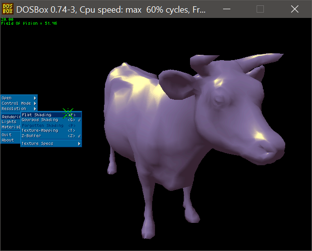
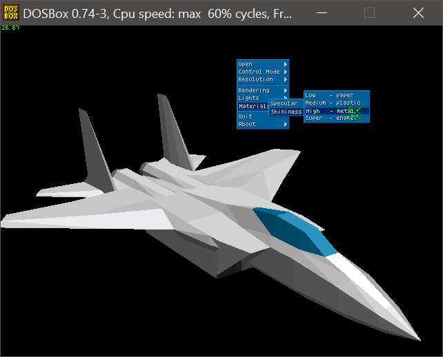
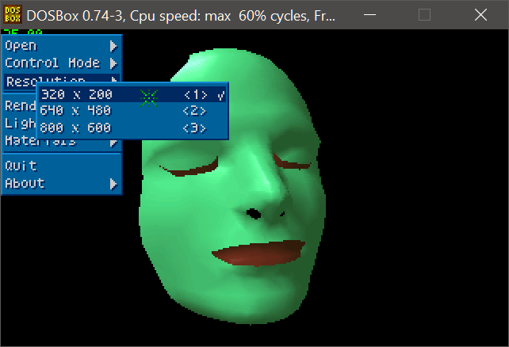

# RTMZ

|  |  |
|---|---|
| Author: | Davide Pasca |
| Platform: | PC MS-DOS, 80386 and above |
| Build environment: | Watcom C++ (with DOS4GW) |

## Overview

This repository is an historical archive of a real-time 3D engine that I developed in the mid 90s.

It's written mostly in 'C'. It runs on MS-DOS with VGA and SVGA resolutions on a 256 colors palette.

Major features are:
- Gouraud shading
- Texture mapping
- Basic lighting and material properties
- Z-Buffer (optional)
- Cool menu interface

